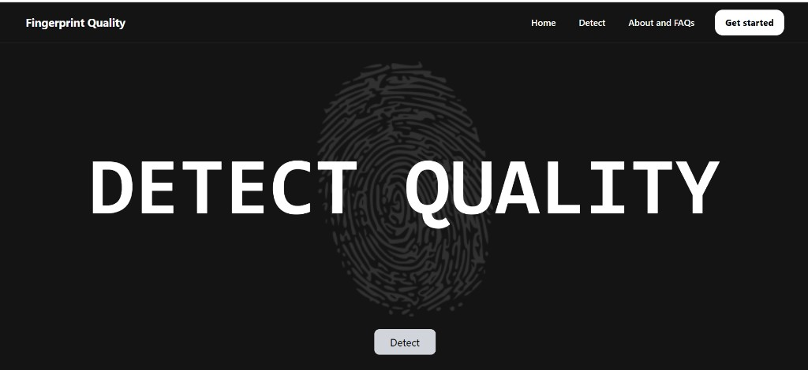
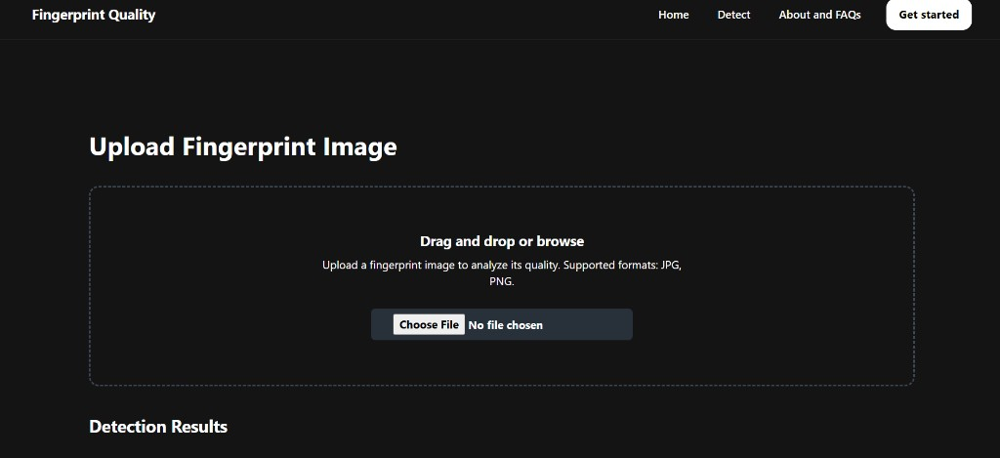

# Fingerprint Quality Detector

A web-based application that lets users upload fingerprint images and instantly get a quality analysis using two machine learning models — **CNN** and **SVM**. Built with **Next.js** on the frontend/API and **Gradio** on Hugging Face for hosted model inference.

## Demo

👉 [Live Demo on Vercel](https://finger-print-quality-detector.vercel.app/)

## Screenshots

### Homepage



### Upload & Detection



---

## Features

- Upload a fingerprint image (JPG/PNG)
- Get predictions from two models:
  - **CNN Model:** outputs a quality score (0 to 1)
  - **SVM Model:** classifies as **Good** or **Bad**
- Responsive dark-themed UI
- Toast notifications for success/failure

---

## Dataset

Fingerprint images split into two classes:

- **Good quality** thumbs
- **Bad quality** thumbs

### Preprocessing

| Step | Details |
|------|---------|
| Image size | Resized to **100 × 100** pixels |
| Color | Converted to **grayscale** |
| Normalization | Pixel values scaled to **0–1** |
| Train/Test split | **80% train / 20% test** |

**SVM-specific:** images flattened to **10,000-length** 1D vectors  
**CNN-specific:** images kept as **100 × 100 × 1** to preserve spatial structure

---

## ML Models

### 1. SVM (Support Vector Machine)

| Property | Details |
|----------|---------|
| Library | `sklearn.svm.SVC` |
| Input | Flattened 10,000-dim grayscale vector |
| Output | Binary — **Good** or **Bad** |
| Tuning | `GridSearchCV` with 5-fold cross-validation |

**Hyperparameter search:**

```python
param_grid = {
    'C': [0.1, 1, 10],
    'kernel': ['linear', 'rbf']
}
```

**Best configuration:**

| Parameter | Value |
|-----------|-------|
| C | 1 |
| gamma | scale |
| kernel | rbf |

**Results:** ~**76%** test accuracy | **77.5%** cross-validation accuracy

---

### 2. CNN (Convolutional Neural Network)

| Property | Details |
|----------|---------|
| Framework | TensorFlow / Keras |
| Input | 100 × 100 × 1 grayscale image |
| Output | Sigmoid score (0 to 1) |
| Loss | Binary cross-entropy |
| Optimizer | RMSprop (lr = 0.01) |
| Batch size | 32 |

**Architecture:**

```
Input (100, 100, 1)
    │
    ├─ Conv2D(32, 3×3) → ReLU
    ├─ MaxPooling2D(2×2)
    ├─ Conv2D(64, 3×3) → ReLU
    ├─ MaxPooling2D(2×2)
    ├─ Flatten
    ├─ Dense(512) → ReLU
    └─ Dense(1) → Sigmoid
```

**Augmented version** (used for better generalization):

```
Input (100, 100, 1)
    │
    ├─ RandomRotation(0.02)
    ├─ RandomTranslation(0.02, 0.02)
    ├─ Conv2D(32, 3×3) → ReLU
    ├─ MaxPooling2D(2×2)
    ├─ Conv2D(64, 3×3) → ReLU
    ├─ MaxPooling2D(2×2)
    ├─ Flatten
    ├─ Dense(512) → ReLU
    └─ Dense(1) → Sigmoid
```

> **Note:** `RandomFlip` was intentionally avoided — flipping fingerprints horizontally alters critical biometric features and dropped validation accuracy to ~50%.

**Training techniques:**
- EarlyStopping callback
- ImageDataGenerator for augmentation pipeline
- 15 epochs (base model) / 35 epochs (augmented model)

---

## Model Comparison

| Model | Test Accuracy | Cross-Val Accuracy | Output | Pros | Cons |
|-------|--------------|-------------------|--------|------|------|
| **SVM** | ~76% | 77.5% | Good / Bad | Lightweight, fast, interpretable | Requires flattening, limited spatial learning |
| **CNN (no aug.)** | ~97% | ~95% | Score 0–1 | Strong feature extraction, high accuracy | Risk of overfitting without augmentation |
| **CNN (with aug.)** | ~95% | ~93% | Score 0–1 | Better generalization, production-ready | Heavier, needs GPU for training |

### CNN Experiment Results

| Configuration | Training Accuracy | Validation Accuracy | Notes |
|---------------|------------------|--------------------|----|
| Without augmentation | 97% | 95% | High accuracy but risk of overfitting |
| With augmentation | 95% | 93% | Better generalization on unseen data |
| With RandomFlip | — | ~50% | Poor — flipping destroys fingerprint patterns |

**Conclusion:** CNN was selected for production due to significantly higher accuracy and its ability to learn spatial fingerprint patterns. SVM serves as a lightweight binary baseline.

---

## Tech Stack

| Tech | Use |
|------|-----|
| [Next.js](https://nextjs.org/) | Frontend + API routes |
| [Tailwind CSS](https://tailwindcss.com/) | Styling |
| [@gradio/client](https://github.com/gradio-app/gradio) | Model prediction via Hugging Face |
| [react-toastify](https://fkhadra.github.io/react-toastify/introduction) | Notifications |
| [TensorFlow/Keras](https://tensorflow.org/) | CNN training |
| [scikit-learn](https://scikit-learn.org/) | SVM training |
| [Vercel](https://vercel.com/) | Deployment |

---

## How It Works

1. User uploads a fingerprint image on the `/detector` page.
2. Image is sent via **POST** to `/api/predict`.
3. Server-side code uses `@gradio/client` to connect to hosted Gradio models on Hugging Face.
4. Results from both **CNN** and **SVM** are returned and displayed.

---

## Project Structure

```
Finger-Print-Quality-Detector/
├── CNN.ipynb                  # CNN model training notebook
├── model.ipynb                # SVM model training notebook
├── svm_model.pkl              # Trained SVM model
├── MODELS.md                  # Detailed model documentation
├── screenshots/
│   ├── homepage.png
│   └── detector.png
└── fingerprintquality/        # Next.js web app
    ├── src/app/
    │   ├── api/predict/route.js
    │   ├── detector/page.js
    │   └── components/
    └── package.json
```

---

## Installation & Running Locally

```bash
git clone https://github.com/0xfatima/Finger-Print-Quality-Detector.git
cd Finger-Print-Quality-Detector/fingerprintquality
npm install
npm run dev
```

Visit: http://localhost:3000

---

## Future Improvements

- Batch upload support
- Display confidence scores
- Database integration for storing results
- Visual feedback per model prediction
